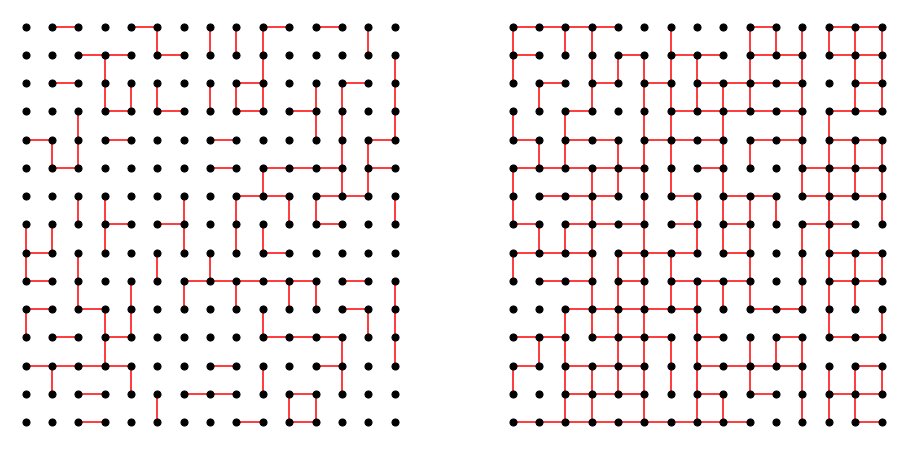

# Introduction to Percolation



Percolation theory describes the behavior of a network when nodes or links are added. This is a geometric type of phase transition, since at a critical fraction of addition the network of small, disconnected clusters merge into significantly larger connected, so-called spanning cluster.

{cite:t}`Grimmett1999-qx`

```{tableofcontents}
```
